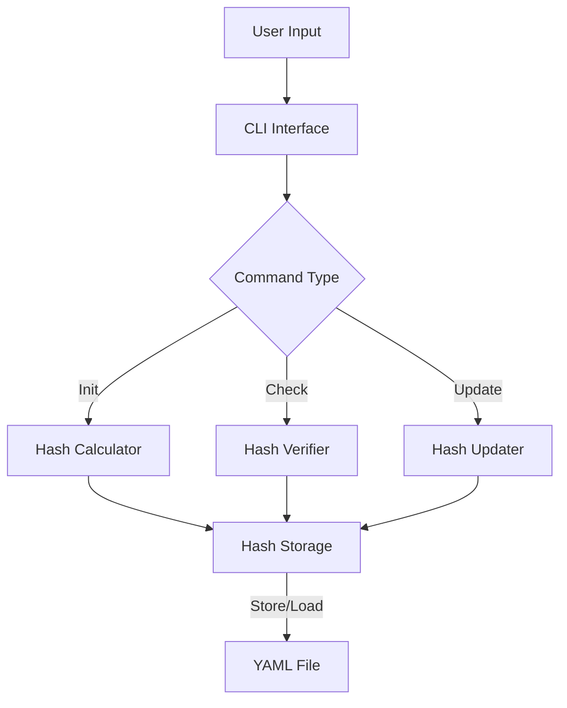

# File Integrity Checker

<div align="center">
  
  
  
</div>

## 📖 Project Description

A robust command-line tool for monitoring and verifying file integrity using cryptographic hashing. This security tool helps detect unauthorized modifications to files by maintaining and comparing SHA-256 hashes.

### 🎯 Project Goals

- Learn about cryptographic hashing and file integrity verification
- Implement secure file monitoring system
- Understand CLI application development in Python
- Practice secure coding and data storage

### 🔍 Project Source

This project is based on the [File Integrity Checker](https://roadmap.sh/projects/file-integrity-checker) from roadmap.sh's project collection.

## 🛠️ Technologies Used

- **Python**: Core programming language
- **Click**: CLI framework for command handling
- **PyYAML**: YAML-based hash storage
- **hashlib**: Cryptographic hash functions
- **pathlib**: File system operations

## 🎯 Features

- **File & Directory Support**: Process individual files or entire directories
- **SHA-256 Hashing**: Industry-standard cryptographic hash function
- **Secure Storage**: YAML-based persistent hash storage
- **Change Detection**: Accurate identification of file modifications
- **Clear Reporting**: User-friendly status messages
- **Manual Updates**: Support for legitimate file changes

## 🏗️ Architecture



## 📋 Prerequisites

- Python 3.8 or higher
- pip (Python package manager)
- Git (optional, for cloning)

## 🚀 Installation

1. Clone the repository:
```bash
git clone https://github.com/kaalpanikh/file-integrity-checker.git
cd file-integrity-checker
```

2. Install dependencies:
```bash
pip install -r requirements.txt
```

3. Make the script executable (Unix-like systems):
```bash
chmod +x integrity-check
```

## 💻 Usage

### Basic Commands

```bash
# Initialize file/directory hashes
./integrity-check init <path>

# Check file/directory integrity
./integrity-check check <path>

# Update file hash after legitimate changes
./integrity-check update <path>
```

### Example Workflow

```bash
# Initialize a directory
./integrity-check init /var/log
> Hashes stored successfully.

# Check a specific file
./integrity-check check /var/log/syslog
> Status: Modified (Hash mismatch)

# Update after legitimate changes
./integrity-check update /var/log/syslog
> Hash updated successfully.
```

## 📁 Project Structure

```
file-integrity-checker/
├── integrity_checker.py  # Main implementation
├── integrity-check      # Executable script
├── requirements.txt     # Project dependencies
├── README.md           # Project documentation
├── DEVELOPMENT_GUIDE.md # Detailed development guide
└── .file_hashes.yml    # Hash storage (created on first run)
```

## 🔒 Security Features

1. **Cryptographic Security**
   - SHA-256 hashing algorithm
   - Collision resistance
   - Pre-image resistance

2. **Safe File Operations**
   - Binary mode file reading
   - Chunk-based processing
   - Path validation

3. **Secure Storage**
   - Local YAML storage
   - No network transmission
   - Clear error reporting

## 📚 Learning Outcomes

1. **Cryptography**
   - Hash function properties
   - Data integrity verification
   - Security considerations

2. **Python Development**
   - CLI application creation
   - File system operations
   - Type hints and documentation

3. **Best Practices**
   - Modular code organization
   - Error handling
   - Security-first thinking

## 🔄 Development Workflow

1. **Setup Environment**
   - Install Python 3.8+
   - Install dependencies
   - Configure development tools

2. **Implementation**
   - Core hash functions
   - CLI commands
   - Storage management

3. **Testing**
   - Functionality testing
   - Edge case handling
   - Security validation

## 🤝 Contributing

Contributions are welcome! Please feel free to submit pull requests.

1. Fork the repository
2. Create your feature branch
3. Commit your changes
4. Push to the branch
5. Create a Pull Request

## 📝 License

This project is licensed under the MIT License - see the [LICENSE](LICENSE) file for details.

## 🔗 Additional Resources

- [Project Requirements](https://roadmap.sh/projects/file-integrity-checker)
- [Python hashlib Documentation](https://docs.python.org/3/library/hashlib.html)
- [Click Documentation](https://click.palletsprojects.com/)
- [PyYAML Documentation](https://pyyaml.org/wiki/PyYAMLDocumentation)

## 👤 Author

Nikhil Kalapala (@kaalpanikh)

## 🙏 Acknowledgments

- [roadmap.sh](https://roadmap.sh) for the project idea and requirements
- Python community for excellent libraries and tools
- Contributors and users of this project